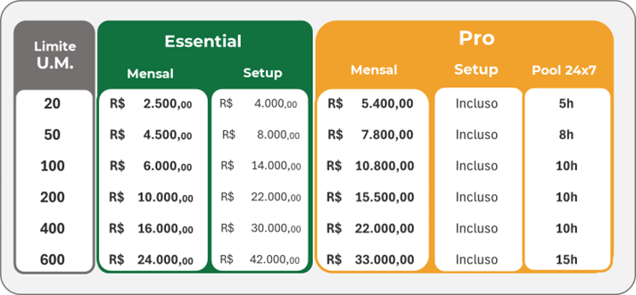

# Product Briefing: Monitoração 24x7

## 📋 Sumário Executivo

### O que é o produto?

**Monitoração 24x7** é uma solução gerenciada de observabilidade empresarial que combina tecnologia de ponta, processos padronizados e suporte especializado para garantir a disponibilidade e performance de infraestruturas críticas na nuvem AWS.

### Para quem é?

Empresas que operam infraestruturas críticas na AWS e necessitam de:

- Vigilância ininterrupta de seus ambientes
- Resposta rápida a incidentes
- Redução do MTTR (Mean Time To Repair)
- Expertise especializada sem manter equipe própria 24x7

### Proposta de Valor Principal

> **"Transformamos complexidade em tranquilidade operacional, garantindo que sua infraestrutura AWS esteja sempre disponível, performática e otimizada."**

---

## 🎯 Visão Geral do Produto

### Missão

Prover monitoramento proativo e resposta imediata a incidentes, reduzindo o tempo de indisponibilidade e garantindo a continuidade dos negócios de nossos clientes.

### Principais Benefícios

- ⏱️ **Redução de até 70% no MTTR** através de ações automatizadas
- 🔍 **Visibilidade completa** da infraestrutura em tempo real
- 👥 **Economia de até 60%** comparado a equipe própria 24x7
- 📈 **Melhoria contínua** com análise de causa raiz
- 🛡️ **Garantia de SLA** com penalidades contratuais

---

## 🏆 Tiers de Serviço

### **Essential Tier**

*Para operações que precisam de monitoramento confiável com orçamento otimizado*

#### Características Principais:

- ✅ Monitoramento 24x7 com equipe N1
- ✅ Resolução imediata de problemas mapeados
- ✅ Triagem e escalonamento inteligente
- ✅ Dashboard personalizado no Zabbix
- ✅ Relatórios mensais de disponibilidade

#### Ideal para:

- Ambientes de produção com criticidade média
- Empresas em crescimento
- Orçamentos controlados

### **PRO Tier**

*Para operações complexas que exigem expertise avançada e foco em inovação*

#### Características Principais:

- ✅ **Tudo do Essential, mais:**
- ✅ Suporte N2 especializado 24x7
- ✅ 8-15 horas mensais de análise de causa raiz
- ✅ Automação de correções recorrentes
- ✅ Propostas contínuas de otimização
- ✅ Setup inicial incluso
- ✅ Gestão proativa de conhecimento

#### Ideal para:

- Infraestruturas mission-critical
- Operações complexas multi-cloud
- Empresas com foco em inovação

---

## 📊 SLAs e Compromissos de Serviço

### Tempos de Resposta (Primeira Ação)

| Criticidade         | Descrição                      | SLA Essential | SLA PRO    |
| ------------------- | -------------------------------- | ------------- | ---------- |
| **🔴 HIGH**   | Indisponibilidade total          | 15 minutos    | 15 minutos |
| **🟡 MEDIUM** | Degradação severa              | 30 minutos    | 30 minutos |
| **🟢 LOW**    | Impacto operacional gerenciável | 60 minutos    | 60 minutos |

### Tempos de Atualização

| Criticidade         | Essential | PRO     |
| ------------------- | --------- | ------- |
| 🔴 HIGH             | 2 horas   | 1 hora  |
| **🟡 MEDIUM** | 4 horas   | 2 horas |
| **🟢 LOW**    | 8 horas   | 4 horas |

### Penalidades por Descumprimento

- SLA de até 95% de cumprimento mensal. A partir daí, desconto proporcional ao tempo violado, com o limite de até **5% na fatura mensal.**
- Só apuramos quando solicitado pelo cliente. Os créditos são aplicados automaticamente na próxima fatura

---

## 💰 Modelo de Precificação

### Como funciona?

Precificação baseada em **Unidades Monitoráveis (U.M.)** - qualquer recurso de infraestrutura que precisa ser monitorado.

### O que é uma U.M.?

- ✓ **Identificável**: Possui identidade única na AWS
- ✓ **Configurável**: Permite aplicação de configurações de monitoramento
- ✓ **Observável**: Gera métricas, logs e eventos
- ✓ **Mensurável**: Base para cobrança do serviço

### Tabela de Preços



*Valores sujeitos a customização para volumes maiores*

---

## 🔧 Como Funciona

### 1️⃣ **Setup Inicial**

#### Essential:

- Configuração de U.M. no Zabbix/CloudWatch
- Mapeamento do ambiente
- Definição de alertas por criticidade
- Documentação de procedimentos básicos

#### PRO:

- **Tudo do Essential, mais:**
- Integrações com ferramentas APM existentes (Datadog, New Relic)
- Métricas customizadas avançadas
- Automações iniciais
- Workshop de alinhamento

### 2️⃣ **Operação 24x7**

#### Fluxo de Monitoramento:

```
[Coleta de Métricas] → [Análise de Thresholds] → [Geração de Alertas]
         ↓                                              ↓
[Dashboard em Tempo Real]                    [Sistema ITSM Darede]
         ↓                                              ↓
[Visibilidade Cliente]                        [Ação da Equipe NOC]
```

#### Processo de Resposta a Incidentes:

1. **Detecção**: Alerta automático via ferramentas
2. **Triagem**: Classificação por criticidade (HIGH/MEDIUM/LOW)
3. **Ação Inicial**:
   - Essential: Resolução de problemas mapeados (N1)
   - PRO: Investigação avançada e causa raiz (N2)
4. **Resolução ou Escalonamento**: Ação direta ou acionamento de especialistas
5. **Documentação**: Registro completo no ITSM
6. **Melhoria**: Análise pós-incidente e otimização de processos

### 3️⃣ **Entregáveis Contínuos**

#### Mensalmente:

- 📊 Relatório de disponibilidade e performance
- 📈 Análise de tendências e padrões
- 🎯 Recomendações de otimização (PRO)
- 📋 Review de incidentes críticos

#### Trimestralmente:

- 🔍 Análise profunda de ambiente (PRO)
- 💡 Propostas de automação
- 📚 Atualização de documentação

---

## 📦 Catálogo de Unidades Monitoráveis

*[Lista completa disponível no catálogo técnico](./index.htm)*

---

## 🚀 Diferenciais Competitivos

### Por que escolher nossa Monitoração 24x7?

1. **🏅 Parceiro AWS Premier Tier**

   - Expertise certificada e reconhecida pela AWS
   - Acesso a suporte prioritário e recursos exclusivos
2. **⚡ Automação Inteligente**

   - Scripts customizados para recuperação automática
   - Redução drástica do tempo de resolução
3. **📊 Plataforma Unificada**

   - Dashboard único no Zabbix
   - Visibilidade completa em tempo real
   - Histórico completo de métricas
4. **👥 Equipe Especializada**

   - Profissionais certificados AWS
   - Treinamento contínuo
   - Conhecimento acumulado de múltiplos clientes
5. **💡 Melhoria Contínua**

   - Processo estruturado de lessons learned
   - Incorporação de melhores práticas
   - Evolução constante dos procedimentos

---

## 📈 Casos de Uso Típicos

### Cenário 1: E-commerce de Alto Volume

**Problema**: Picos de tráfego causando indisponibilidades
**Solução**: Monitoramento proativo com auto-scaling automatizado
**Resultado**: Zero downtime em Black Friday

### Cenário 2: Fintech com Compliance Rígido

**Problema**: Necessidade de rastreabilidade total
**Solução**: PRO Tier com análise de causa raiz documentada
**Resultado**: Aprovação em auditoria SOC2

### Cenário 3: Startup em Crescimento

**Problema**: Recursos limitados para equipe 24x7
**Solução**: Essential Tier com escalonamento inteligente
**Resultado**: Economia de 60% vs equipe própria

---

## 🎯 Roadmap do Produto

### Q1 2025

- ✅ Lançamento do catálogo de U.M. expandido
- ✅ Integração com Zabbix 6.0
- 🔄 Dashboard mobile (em desenvolvimento)

### Q2 2025

- 📅 Integração com ServiceNow
- 📅 ML para predição de incidentes
- 📅 Portal self-service para clientes

### Q3-Q4 2025

- 📅 Expansão para Azure e GCP
- 📅 Certificação ISO 20000
- 📅 Tier Enterprise com SLA 99.99%

---

## 📞 Informações de Contato

### Para Vendas:

- 📧 comercial@darede.com.br
- 📱 0800-XXX-XXXX

### Suporte Técnico (Clientes):

- 📧 noc@darede.com.br
- 📱 Linha direta 24x7: (XX) XXXX-XXXX

### Escalação Gerencial:

- 📧 gestao.monitoracao@darede.com.br

---

## 📝 Termos e Condições Importantes

### Inclusões:

- ✅ Monitoramento 24x7 conforme tier contratado
- ✅ Acesso ao dashboard Zabbix
- ✅ Relatórios mensais
- ✅ Suporte via canais oficiais
- ✅ SLA garantido com penalidades

### Exclusões:

- ❌ Desenvolvimento de código customizado
- ❌ Gestão de mudanças não comunicadas
- ❌ Recursos fora do catálogo de U.M. (sob consulta)
- ❌ Hands-on em produção sem aprovação

### Pré-requisitos do Cliente:

- Acesso administrativo aos recursos AWS
- Documentação atualizada do ambiente
- Ponto focal designado
- Canal de comunicação estabelecido

---

## 🔒 Segurança e Compliance

### Certificações:

- ISO 27001 (Segurança da Informação)
- SOC 2 Type II
- LGPD Compliant

### Práticas de Segurança:

- Acesso baseado em roles (RBAC)
- Auditoria completa de ações
- Criptografia em trânsito e repouso
- Segregação de ambientes por cliente

---

## 💪 Por que Darede?

### Nossa História:

- **15+ anos** de experiência em cloud
- **500+ clientes** atendidos
- **99.8%** de satisfação do cliente
- **50+ certificações** técnicas da equipe

### Nosso Compromisso:

> "Não apenas monitoramos sua infraestrutura, nós cuidamos dela como se fosse nossa. Seu sucesso é nosso sucesso."

---

*Documento atualizado em: Janeiro 2025*
*Versão: 1.0*
*Classificação: Público*

---

**© 2025 Darede - Todos os direitos reservados**
